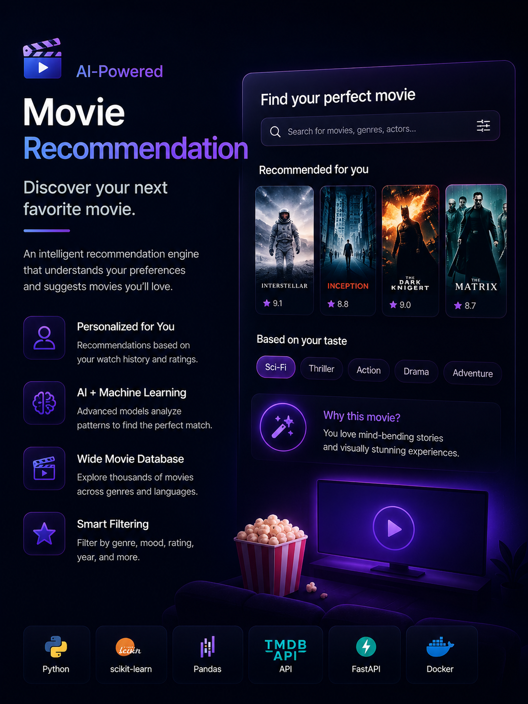
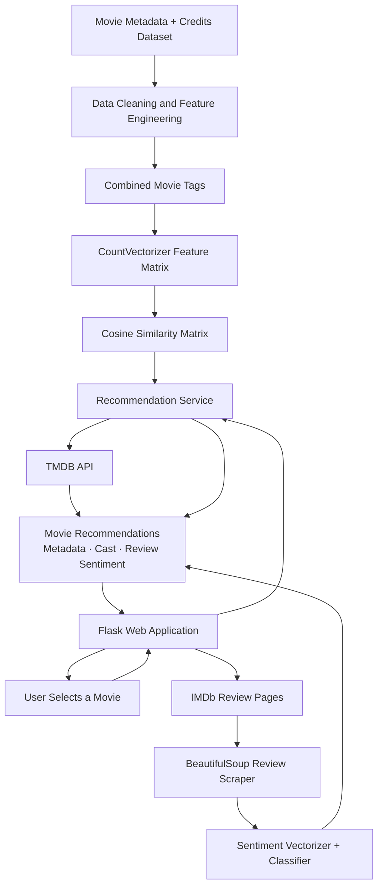
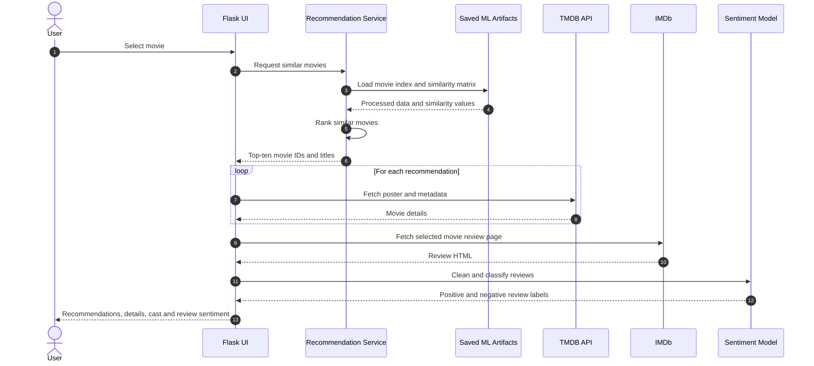

<p align="center">
  
</p>

<h1 align="center">Movie Recommendation & Review Intelligence Engine</h1>

<p align="center">
  <strong>A content-based movie recommender enriched with TMDB metadata and IMDb review sentiment intelligence.</strong>
</p>

<p align="center">
  Python · scikit-learn · Cosine Similarity · NLP · Flask · TMDB API · BeautifulSoup
</p>

---

> **Public project:** This project demonstrates classical machine-learning fundamentals, feature engineering, recommendation logic, external API integration, web scraping, NLP inference, and lightweight web delivery.

## Overview

The **Movie Recommendation & Review Intelligence Engine** is an end-to-end machine-learning application that helps users discover movies similar to a selected title and understand the general sentiment of audience reviews.

The system combines two complementary capabilities:

1. **Content-based movie recommendation**  
   Movies are represented through engineered textual features such as genres, keywords, overview, cast, and crew. The application converts those features into a numeric representation and ranks similar movies using cosine similarity.

2. **Review sentiment intelligence**  
   IMDb reviews are collected, cleaned, transformed, and classified using a trained NLP model to estimate whether audience feedback is positive or negative.

The application then enriches the recommendation output with live metadata from the **TMDB API**, including:

- posters;
- genres;
- runtime;
- rating;
- release date;
- overview;
- cast information;
- crew information.

The result is a complete movie-discovery experience rather than a bare list of similar titles.

---

## Hiring Signal

This project demonstrates:

- classical machine-learning fundamentals;
- content-based recommender-system design;
- text feature engineering;
- sparse vector representations;
- cosine similarity ranking;
- NLP preprocessing and inference;
- model persistence;
- web scraping;
- external API integration;
- Flask backend delivery;
- end-to-end ML product thinking.

---

## Table of Contents

1. [Problem Statement](#problem-statement)
2. [Objectives and Non-Goals](#objectives-and-non-goals)
3. [Impact Snapshot](#impact-snapshot)
4. [My Role](#my-role)
5. [Solution Overview](#solution-overview)
6. [High-Level Design](#high-level-design)
7. [End-to-End Workflow](#end-to-end-workflow)
8. [Recommendation Methodology](#recommendation-methodology)
9. [Feature Engineering](#feature-engineering)
10. [Vectorization and Similarity](#vectorization-and-similarity)
11. [Review Sentiment Pipeline](#review-sentiment-pipeline)
12. [Low-Level Design](#low-level-design)
13. [Data Contracts](#data-contracts)
14. [TMDB Metadata Enrichment](#tmdb-metadata-enrichment)
15. [IMDb Review Collection](#imdb-review-collection)
16. [Flask Application Design](#flask-application-design)
17. [Validation and Reliability](#validation-and-reliability)
18. [Performance Engineering](#performance-engineering)
19. [Error Handling](#error-handling)
20. [Technology Stack](#technology-stack)
21. [Representative Repository Structure](#representative-repository-structure)
22. [Installation and Setup](#installation-and-setup)
23. [Running the Application](#running-the-application)
24. [Testing Strategy](#testing-strategy)
25. [Example Workflow](#example-workflow)
26. [Challenges and Resolutions](#challenges-and-resolutions)
27. [Engineering Decisions](#engineering-decisions)
28. [Limitations](#limitations)
29. [Future Enhancements](#future-enhancements)
30. [Impact Statement](#impact-statement)

---

## Problem Statement

Movie-discovery platforms often recommend content using large-scale collaborative filtering, user histories, and proprietary interaction data.

For a standalone portfolio project, that data is not available.

The challenge was therefore to build a recommendation system that could still provide useful results using only information about the movies themselves.

A good solution needed to:

- understand what each movie is about;
- combine several textual and categorical signals;
- find movies with similar characteristics;
- exclude the selected movie from its own recommendations;
- enrich the results with useful visual and descriptive metadata;
- provide an additional view into audience reaction through sentiment analysis;
- expose the complete workflow through a simple web application.

---

## Objectives and Non-Goals

### Objectives

- Recommend similar movies from content features.
- Combine multiple movie attributes into one feature representation.
- Produce a top-ten ranked recommendation list.
- Exclude the selected movie from the result set.
- Enrich recommendations through the TMDB API.
- Scrape and classify IMDb reviews.
- Persist trained models and processed artifacts.
- Deliver the experience through a lightweight Flask application.
- Keep the implementation understandable and reproducible.

### Non-Goals

- Replicate a production-scale streaming recommendation system.
- Use private viewing histories or personal user profiles.
- Claim that content similarity equals personal preference.
- Provide real-time collaborative filtering.
- Scrape websites at high volume.
- Replace official ratings or editorial reviews.
- Use deep learning when classical ML is sufficient.

---

## Impact Snapshot

| Area | Outcome |
|---|---|
| Recommendation | Generated a ranked top-ten list of similar movies |
| Feature Engineering | Combined genres, keywords, overview, cast, and crew |
| Similarity | Used cosine similarity over a vectorized feature matrix |
| Metadata | Added posters, genres, cast, runtime, ratings, and release information |
| Review Intelligence | Classified scraped IMDb reviews using a trained sentiment model |
| Product Delivery | Delivered the workflow through a Flask web application |
| ML Coverage | Demonstrated recommendation, NLP, API, scraping, and backend integration |

> The project is positioned as a portfolio implementation rather than a production recommender with live user-personalization metrics.

---

## My Role

I built the project end to end.

### Data Preparation

- Loaded and explored the movie and credits datasets.
- Merged movie metadata with cast and crew information.
- Selected and normalized relevant recommendation features.
- Removed unusable or incomplete records.
- Converted nested fields into machine-learning-friendly structures.

### Feature Engineering

- Extracted genres and keywords.
- Selected the most relevant cast members.
- Identified the director from crew data.
- Tokenized and normalized movie overviews.
- Combined all selected features into a single `tags` field.

### Recommendation Engine

- Built the feature matrix using `CountVectorizer`.
- Calculated pairwise cosine similarity.
- Implemented top-ten similarity ranking.
- Excluded the selected movie from its own result.
- Mapped internal results back to movie titles and IDs.

### Metadata Enrichment

- Integrated the TMDB API.
- Retrieved posters and movie details.
- Retrieved cast and profile metadata.
- Added runtime, rating, release date, genres, and overview.

### Sentiment Intelligence

- Collected IMDb reviews using BeautifulSoup.
- Cleaned and normalized review text.
- Loaded the trained vectorizer and sentiment classifier.
- Classified reviews as positive or negative.

### Web Delivery

- Built the Flask routes and request flow.
- Connected recommendation, metadata, and sentiment services.
- Added response handling for missing movies and external API failures.
- Created a usable end-to-end movie-discovery experience.

---

## Solution Overview

The solution is divided into five main layers.

### 1. Data Preparation Layer

Processes raw movie and credits data into a recommendation-ready dataset.

### 2. Recommendation Layer

Transforms text features into vectors and ranks movies using cosine similarity.

### 3. Metadata Layer

Calls TMDB to retrieve current presentation metadata for recommendations.

### 4. Sentiment Layer

Collects IMDb review text and classifies review sentiment.

### 5. Web Layer

Coordinates the complete flow through Flask and renders the result.

---

## High-Level Design



### Architectural Boundaries

| Layer | Responsibility |
|---|---|
| Dataset Layer | Raw movie and credits data |
| Feature Layer | Clean and combine recommendation attributes |
| ML Layer | Vectorization and similarity ranking |
| API Layer | TMDB enrichment |
| Scraping Layer | IMDb review collection |
| NLP Layer | Review sentiment classification |
| Web Layer | Request handling and output rendering |

---

## End-to-End Workflow



---

## Recommendation Methodology

The recommendation engine uses **content-based filtering**.

Each movie is represented using descriptive information from the movie itself.

### Selected Features

- genres;
- keywords;
- overview;
- cast;
- director.

These features are transformed into a single combined textual representation.

### Why Content-Based Filtering?

Content-based filtering is appropriate because:

- it does not require user-history data;
- every recommendation can be traced to movie attributes;
- it works well for a standalone application;
- it is easy to train and deploy;
- it demonstrates classical ML clearly.

### Recommendation Steps

1. Locate the selected movie in the processed dataframe.
2. Retrieve its row index.
3. Read the corresponding cosine-similarity vector.
4. Sort candidate movies by similarity score.
5. Skip the selected movie.
6. Return the top ten remaining results.

Representative implementation:

```python
def recommend_movies(
    title: str,
    movies_df,
    similarity_matrix,
    top_n: int = 10,
) -> list[dict]:
    matches = movies_df.index[
        movies_df["title"].str.lower() == title.strip().lower()
    ].tolist()

    if not matches:
        raise ValueError(f"Movie not found: {title}")

    movie_index = matches[0]
    scores = list(enumerate(similarity_matrix[movie_index]))

    ranked = sorted(
        scores,
        key=lambda item: item[1],
        reverse=True,
    )

    recommendations = []

    for candidate_index, score in ranked:
        if candidate_index == movie_index:
            continue

        row = movies_df.iloc[candidate_index]
        recommendations.append(
            {
                "movie_id": int(row["movie_id"]),
                "title": row["title"],
                "similarity_score": float(score),
            }
        )

        if len(recommendations) == top_n:
            break

    return recommendations
```

---

## Feature Engineering

The quality of a content-based recommender depends heavily on feature engineering.

### Raw Fields

Movie and credits datasets commonly store some attributes as serialized lists or dictionaries.

Examples:

```text
genres
keywords
cast
crew
```

These fields must be parsed before vectorization.

### Genre Extraction

```python
import ast


def extract_names(serialized_value: str) -> list[str]:
    values = ast.literal_eval(serialized_value)
    return [item["name"] for item in values]
```

### Cast Selection

Only the most relevant cast members are retained to prevent the feature space from becoming too noisy.

```python
def extract_top_cast(
    serialized_value: str,
    limit: int = 3,
) -> list[str]:
    values = ast.literal_eval(serialized_value)
    return [item["name"] for item in values[:limit]]
```

### Director Extraction

```python
def extract_director(serialized_value: str) -> list[str]:
    crew = ast.literal_eval(serialized_value)

    for member in crew:
        if member.get("job") == "Director":
            return [member["name"]]

    return []
```

### Token Normalization

Names such as:

```text
Science Fiction
James Cameron
Sam Worthington
```

are normalized to:

```text
ScienceFiction
JamesCameron
SamWorthington
```

This prevents separate tokens such as `James` and `Cameron` from creating unintended matches.

```python
def remove_spaces(values: list[str]) -> list[str]:
    return [value.replace(" ", "") for value in values]
```

### Combined Tag Field

```python
movies["tags"] = (
    movies["overview_tokens"]
    + movies["genres"]
    + movies["keywords"]
    + movies["cast"]
    + movies["director"]
)

movies["tags"] = movies["tags"].apply(
    lambda values: " ".join(values).lower()
)
```

The final `tags` field becomes the recommendation model input.

---

## Vectorization and Similarity

### CountVectorizer

`CountVectorizer` transforms the combined textual features into a sparse count matrix.

Representative configuration:

```python
from sklearn.feature_extraction.text import CountVectorizer


vectorizer = CountVectorizer(
    max_features=5000,
    stop_words="english",
)

feature_matrix = vectorizer.fit_transform(
    movies["tags"]
)
```

### Why CountVectorizer?

- simple and interpretable;
- efficient for a moderate dataset;
- well suited to tokenized metadata;
- easy to persist and reproduce;
- sufficient for a classical content-based recommender.

### Cosine Similarity

Cosine similarity measures the angle between movie vectors.

```python
from sklearn.metrics.pairwise import cosine_similarity


similarity_matrix = cosine_similarity(feature_matrix)
```

Conceptually:

```text
similarity(A, B) =
    dot(A, B) /
    (magnitude(A) * magnitude(B))
```

Scores closer to `1` indicate stronger content similarity.

### Why Cosine Similarity?

It focuses on the orientation of the vectors rather than their raw magnitude. This is useful when movies have different amounts of descriptive metadata but share similar concepts.

---

## Review Sentiment Pipeline

The review-intelligence component classifies audience reviews for the selected movie.

### Processing Stages

1. Fetch the IMDb review page.
2. Extract review text from HTML.
3. Remove markup and noise.
4. Normalize the review text.
5. Transform it with the saved NLP vectorizer.
6. Classify it with the trained sentiment model.
7. Return positive or negative labels.

### Text Cleaning

Representative preprocessing:

```python
import re


def clean_review(text: str) -> str:
    value = text.lower()
    value = re.sub(r"<.*?>", " ", value)
    value = re.sub(r"[^a-z\s]", " ", value)
    value = re.sub(r"\s+", " ", value)
    return value.strip()
```

### Model Inference

```python
def classify_reviews(
    reviews: list[str],
    vectorizer,
    classifier,
) -> list[dict]:
    cleaned = [clean_review(review) for review in reviews]
    vectors = vectorizer.transform(cleaned)
    predictions = classifier.predict(vectors)

    return [
        {
            "review": original,
            "sentiment": (
                "Positive"
                if int(prediction) == 1
                else "Negative"
            ),
        }
        for original, prediction in zip(reviews, predictions)
    ]
```

### Separation of Concerns

Recommendation and sentiment are independent ML components:

- the recommendation engine ranks movies;
- the sentiment model interprets reviews.

This makes both parts easier to test and replace independently.

---

## Low-Level Design

### Core Components

| Component | Responsibility |
|---|---|
| Data Loader | Loads movie and credits datasets |
| Feature Builder | Parses and combines movie attributes |
| Vectorizer Service | Builds the feature matrix |
| Similarity Service | Calculates and stores cosine similarity |
| Recommendation Service | Ranks similar movies |
| TMDB Client | Fetches movie and cast metadata |
| IMDb Scraper | Collects review text |
| Sentiment Service | Cleans and classifies reviews |
| Flask Routes | Coordinates requests and renders output |
| Artifact Loader | Loads persisted dataframes and models |
| Error Mapper | Converts exceptions into user-friendly states |

### Artifact Loading

```python
from dataclasses import dataclass
import pickle


@dataclass
class ModelArtifacts:
    movies: object
    similarity: object
    sentiment_vectorizer: object
    sentiment_model: object


def load_artifacts() -> ModelArtifacts:
    with open("artifacts/movies.pkl", "rb") as file:
        movies = pickle.load(file)

    with open("artifacts/similarity.pkl", "rb") as file:
        similarity = pickle.load(file)

    with open("artifacts/sentiment_vectorizer.pkl", "rb") as file:
        sentiment_vectorizer = pickle.load(file)

    with open("artifacts/sentiment_model.pkl", "rb") as file:
        sentiment_model = pickle.load(file)

    return ModelArtifacts(
        movies=movies,
        similarity=similarity,
        sentiment_vectorizer=sentiment_vectorizer,
        sentiment_model=sentiment_model,
    )
```

### Service Orchestration

```python
def build_movie_intelligence(
    title: str,
    artifacts: ModelArtifacts,
    tmdb_client,
    imdb_client,
) -> dict:
    recommendations = recommend_movies(
        title=title,
        movies_df=artifacts.movies,
        similarity_matrix=artifacts.similarity,
        top_n=10,
    )

    enriched = [
        tmdb_client.get_movie_details(item["movie_id"])
        for item in recommendations
    ]

    selected_movie = find_movie_record(
        title=title,
        movies_df=artifacts.movies,
    )

    reviews = imdb_client.fetch_reviews(
        movie_id=int(selected_movie["movie_id"])
    )

    review_intelligence = classify_reviews(
        reviews=reviews,
        vectorizer=artifacts.sentiment_vectorizer,
        classifier=artifacts.sentiment_model,
    )

    return {
        "selected_movie": title,
        "recommendations": enriched,
        "reviews": review_intelligence,
    }
```

---

## Data Contracts

### Recommendation Item

```python
from pydantic import BaseModel, Field


class RecommendationItem(BaseModel):
    movie_id: int
    title: str
    similarity_score: float = Field(ge=0, le=1)
    poster_url: str | None = None
    genres: list[str] = []
    rating: float | None = None
    runtime_minutes: int | None = None
    release_date: str | None = None
    overview: str | None = None
```

### Cast Member

```python
class CastMember(BaseModel):
    name: str
    character: str | None = None
    profile_url: str | None = None
```

### Review Sentiment

```python
class ReviewSentiment(BaseModel):
    review: str
    sentiment: str
```

### Complete Response

```python
class MovieIntelligenceResponse(BaseModel):
    selected_movie: str
    recommendations: list[RecommendationItem]
    cast: list[CastMember]
    reviews: list[ReviewSentiment]
    warnings: list[str] = []
```

---

## TMDB Metadata Enrichment

The recommender stores the movie IDs required for metadata lookup.

### Typical TMDB Data

- poster path;
- title;
- overview;
- release date;
- runtime;
- genres;
- vote average;
- cast;
- character names;
- profile images.

### Client Design

```python
import os
import requests


class TMDBClient:
    def __init__(self) -> None:
        self.api_key = os.environ["TMDB_API_KEY"]
        self.base_url = "https://api.themoviedb.org/3"
        self.timeout_seconds = 8

    def get_movie_details(self, movie_id: int) -> dict:
        response = requests.get(
            f"{self.base_url}/movie/{movie_id}",
            params={"api_key": self.api_key},
            timeout=self.timeout_seconds,
        )
        response.raise_for_status()
        return response.json()

    def get_movie_credits(self, movie_id: int) -> dict:
        response = requests.get(
            f"{self.base_url}/movie/{movie_id}/credits",
            params={"api_key": self.api_key},
            timeout=self.timeout_seconds,
        )
        response.raise_for_status()
        return response.json()
```

### Secret Handling

The TMDB API key should be stored in:

```text
TMDB_API_KEY
```

It should never be hardcoded or committed to source control.

---

## IMDb Review Collection

The project uses controlled scraping for review text.

### Scraping Principles

- use timeouts;
- use a clear user agent;
- retrieve only the required page;
- avoid high-volume requests;
- validate HTML structure;
- handle missing selectors;
- do not assume every movie has reviews;
- cache when appropriate.

### Representative Scraper

```python
import requests
from bs4 import BeautifulSoup


def fetch_imdb_reviews(review_url: str) -> list[str]:
    response = requests.get(
        review_url,
        headers={
            "User-Agent": "Mozilla/5.0 MovieRecommendationPortfolio/1.0"
        },
        timeout=10,
    )
    response.raise_for_status()

    soup = BeautifulSoup(response.text, "html.parser")

    review_nodes = soup.select(".text.show-more__control")

    return [
        node.get_text(" ", strip=True)
        for node in review_nodes
        if node.get_text(strip=True)
    ]
```

Selectors may need updating when the source website changes.

---

## Flask Application Design

### Representative Routes

```text
GET  /
POST /recommend
GET  /health
```

### Flask Route

```python
from flask import Flask, render_template, request


app = Flask(__name__)


@app.get("/")
def home():
    return render_template(
        "index.html",
        movie_titles=movie_titles,
    )


@app.post("/recommend")
def recommend():
    title = request.form.get("movie_title", "").strip()

    if not title:
        return render_template(
            "index.html",
            movie_titles=movie_titles,
            error="Please select a movie.",
        )

    try:
        result = build_movie_intelligence(
            title=title,
            artifacts=artifacts,
            tmdb_client=tmdb_client,
            imdb_client=imdb_client,
        )

        return render_template(
            "recommendations.html",
            result=result,
        )

    except ValueError as exc:
        return render_template(
            "index.html",
            movie_titles=movie_titles,
            error=str(exc),
        ), 404
```

### UI Sections

The result page can show:

- selected movie;
- recommendation cards;
- poster;
- rating;
- runtime;
- genres;
- overview;
- cast;
- review sentiment.

---

## Validation and Reliability

### Dataset Validation

- required columns exist;
- movie IDs are unique;
- duplicate titles are handled;
- null overviews are normalized;
- malformed serialized lists are rejected or repaired;
- feature lists contain expected types.

### Recommendation Validation

- selected movie exists;
- selected movie is excluded from output;
- recommendation count does not exceed `top_n`;
- similarity scores are valid;
- candidate movie IDs exist;
- repeated recommendations are removed.

### API Validation

- TMDB status codes are checked;
- timeouts are configured;
- missing poster paths are allowed;
- missing cast is allowed;
- invalid movie IDs produce a warning.

### Sentiment Validation

- empty reviews are skipped;
- vectorizer and classifier versions are compatible;
- prediction labels are normalized;
- malformed HTML does not crash the complete request.

---

## Performance Engineering

### Offline Computation

The expensive recommendation artifacts should be generated offline:

- processed movie dataframe;
- fitted vectorizer;
- feature matrix;
- similarity matrix;
- sentiment vectorizer;
- sentiment classifier.

The Flask application loads these artifacts once at startup.

### Runtime Costs

At request time, the application performs:

- dataframe title lookup;
- similarity-row sorting;
- metadata API calls;
- one review-page request;
- sentiment inference.

### Optimizations

- cache movie metadata;
- load artifacts only once;
- reuse HTTP sessions;
- limit cast and review count;
- configure request timeouts;
- gracefully degrade if metadata or reviews are unavailable;
- use top-k ranking rather than processing unnecessary candidates.

---

## Error Handling

| Failure | Application Behavior |
|---|---|
| Movie title not found | Return a clear validation error |
| Duplicate title ambiguity | Resolve by movie ID or release year |
| Missing model artifact | Fail startup health check |
| Invalid pickle | Return controlled configuration error |
| TMDB key missing | Start in recommendation-only mode or fail fast |
| TMDB timeout | Return recommendation without enrichment |
| Poster missing | Use a placeholder image |
| Cast unavailable | Show movie details without cast |
| IMDb request fails | Return recommendations without reviews |
| HTML selector changes | Return a scraping warning |
| No reviews found | Show a no-reviews state |
| Sentiment model fails | Preserve review text without labels |
| Unexpected error | Log safely and return a generic user message |

---

## Technology Stack

| Area | Technology |
|---|---|
| Language | Python |
| Data Processing | pandas, NumPy |
| Machine Learning | scikit-learn |
| Vectorization | CountVectorizer |
| Similarity | Cosine Similarity |
| NLP | Classical text preprocessing and classifier |
| Backend | Flask |
| External Metadata | TMDB API |
| Web Scraping | BeautifulSoup, Requests |
| Model Persistence | Pickle |
| UI | HTML, CSS, JavaScript |
| Deployment | Flask-compatible Python hosting |

---

## Representative Repository Structure

```text
movie-recommendation-review-intelligence-engine/
├── assets/
│   └── movie-recommendation-engine.png
├── app/
│   ├── app.py
│   ├── config.py
│   ├── services/
│   │   ├── recommender.py
│   │   ├── metadata.py
│   │   ├── reviews.py
│   │   └── sentiment.py
│   ├── contracts/
│   │   └── models.py
│   ├── templates/
│   │   ├── index.html
│   │   └── recommendations.html
│   └── static/
│       ├── css/
│       └── js/
├── training/
│   ├── prepare_movies.py
│   ├── build_recommender.py
│   └── train_sentiment_model.py
├── artifacts/
│   ├── movies.pkl
│   ├── similarity.pkl
│   ├── sentiment_vectorizer.pkl
│   └── sentiment_model.pkl
├── data/
│   ├── movies.csv
│   └── credits.csv
├── tests/
│   ├── unit/
│   ├── integration/
│   └── fixtures/
├── requirements.txt
├── .env.example
└── README.md
```

---

## Installation and Setup

### 1. Clone the Repository

```bash
git clone <repository-url>
cd movie-recommendation-review-intelligence-engine
```

### 2. Create a Virtual Environment

```bash
python -m venv .venv
```

```bash
# Windows
.venv\Scripts\activate
```

```bash
# macOS / Linux
source .venv/bin/activate
```

### 3. Install Dependencies

```bash
pip install -r requirements.txt
```

Representative dependencies:

```text
flask
pandas
numpy
scikit-learn
requests
beautifulsoup4
python-dotenv
```

### 4. Configure Environment Variables

Create a local `.env` file:

```text
TMDB_API_KEY=your_tmdb_api_key
FLASK_ENV=development
```

Do not commit `.env`.

### 5. Build Artifacts

```bash
python training/prepare_movies.py
python training/build_recommender.py
python training/train_sentiment_model.py
```

---

## Running the Application

### Development

```bash
flask --app app.app run --debug
```

or:

```bash
python app/app.py
```

Open:

```text
http://127.0.0.1:5000
```

### Production

Use a production WSGI server such as:

```bash
gunicorn app.app:app
```

Production configuration should include:

- environment-based secrets;
- request timeouts;
- structured logging;
- health checks;
- a reverse proxy;
- disabled debug mode.

---

## Testing Strategy

### Unit Tests

- parsing nested feature fields;
- cast selection;
- director extraction;
- token normalization;
- combined tag generation;
- movie lookup;
- top-ten ranking;
- self-exclusion;
- review cleaning;
- sentiment label mapping.

### Model Tests

- feature-matrix shape;
- similarity-matrix symmetry;
- diagonal similarity equals one;
- recommendation score ordering;
- artifact compatibility;
- known movie recommendation snapshots.

### API Tests

- successful TMDB response;
- missing poster;
- timeout;
- invalid movie ID;
- missing API key;
- malformed JSON.

### Scraping Tests

- valid review HTML;
- missing review selector;
- empty review page;
- timeout;
- changed markup;
- HTML entity normalization.

### Flask Contract Tests

- home page loads;
- missing title validation;
- valid recommendation request;
- unknown movie;
- recommendation-only fallback;
- API failure warning;
- no-review state.

### End-to-End Scenarios

- popular movie with full metadata;
- movie with missing cast image;
- movie with no scraped reviews;
- unknown title;
- external API unavailable;
- model artifacts loaded successfully;
- sentiment model unavailable but recommendations still work.

---

## Example Workflow

### User Input

```text
Avatar
```

### Recommendation Processing

1. Find `Avatar` in the processed dataframe.
2. Retrieve its similarity row.
3. Rank all other movies by cosine similarity.
4. Remove `Avatar` from the candidate list.
5. Return the ten highest-ranked titles.

### Metadata Enrichment

For each recommended movie:

1. call TMDB using the movie ID;
2. retrieve poster and movie details;
3. retrieve credits;
4. select the required cast metadata;
5. normalize the response.

### Review Intelligence

1. fetch reviews for the selected movie;
2. extract review text;
3. clean and vectorize reviews;
4. predict sentiment;
5. return positive and negative review cards.

### Final UI

The user receives:

- ten recommended movies;
- posters;
- details and ratings;
- cast information;
- review sentiment.

---

## Challenges and Resolutions

### Nested Dataset Fields

**Challenge:** Genres, keywords, cast, and crew were stored as serialized nested structures.

**Resolution:** Parse fields safely and convert them into normalized token lists.

### No User Interaction Data

**Challenge:** Collaborative filtering was not possible.

**Resolution:** Use content-based filtering over engineered movie features.

### Common Name Tokens

**Challenge:** Splitting names could create false similarity through common first names.

**Resolution:** Remove spaces from multi-word names so each actor or director becomes one token.

### Selected Movie Appearing in Results

**Challenge:** A movie has maximum similarity with itself.

**Resolution:** Explicitly skip the selected row before collecting the top-ten results.

### External API Dependence

**Challenge:** TMDB failures could make the application unusable.

**Resolution:** Separate recommendation generation from metadata enrichment and allow degraded output.

### Scraping Fragility

**Challenge:** IMDb page structure can change.

**Resolution:** Isolate scraping logic, validate selectors, and make review intelligence optional.

### Sentiment and Recommendation Coupling

**Challenge:** One failed component could affect the entire application.

**Resolution:** Treat recommendation, metadata, cast, and sentiment as separate services with independent failure handling.

---

## Engineering Decisions

### Content-Based Filtering

**Decision:** Use movie attributes instead of user-history data.

**Reason:** It is appropriate for the available dataset and produces explainable similarity.

### CountVectorizer

**Decision:** Use a classical bag-of-words feature matrix.

**Reason:** It is fast, interpretable, and effective for structured metadata tokens.

### Cosine Similarity

**Decision:** Rank movies by vector angle.

**Reason:** It works well for sparse textual features and is independent of raw document length.

### Limited Cast Features

**Decision:** Use only the top cast members.

**Reason:** Including the full cast would increase noise and feature dimensionality.

### Director as a Dedicated Feature

**Decision:** Extract the director separately.

**Reason:** Director identity can be a meaningful content signal.

### Offline Artifact Generation

**Decision:** Build matrices and models before serving requests.

**Reason:** It reduces runtime latency and simplifies the Flask request path.

### Optional External Enrichment

**Decision:** Keep TMDB and IMDb outside the core recommendation model.

**Reason:** The recommender remains usable even when external services are unavailable.

---

## Limitations

- Recommendations are not personalized to an individual user.
- The model cannot learn from clicks, ratings, or watch history.
- Keyword quality depends on the source dataset.
- CountVectorizer ignores semantic meaning beyond token overlap.
- Similar movies are not always equally enjoyable to the same user.
- TMDB metadata requires network access and an API key.
- IMDb scraping can break when page structure changes.
- Sentiment labels do not capture sarcasm, mixed opinions, or detailed aspects.
- Pickled artifacts must be regenerated after dependency-breaking changes.

---

## Future Enhancements

- Add TF-IDF comparison.
- Add sentence-embedding similarity.
- Add collaborative filtering.
- Build a hybrid recommender.
- Add user profiles and watch history.
- Add genre and language filters.
- Add release-year and rating controls.
- Add explanation labels such as “similar cast” or “same director.”
- Add Redis metadata caching.
- Replace scraping with a supported review source where available.
- Add aspect-based sentiment analysis.
- Add model evaluation metrics and offline relevance testing.
- Add Docker deployment.
- Add a REST API separate from the UI.
- Add streaming or asynchronous metadata loading.
- Add multilingual review classification.

---

## Impact Statement

The Movie Recommendation & Review Intelligence Engine demonstrates how classical machine learning can be transformed into a complete user-facing product.

The project:

- built a content-based recommendation engine from movie metadata;
- combined genres, keywords, overview, cast, and director features;
- created a vectorized feature space with `CountVectorizer`;
- ranked similar movies using cosine similarity;
- generated top-ten recommendations while excluding the selected title;
- enriched outputs using TMDB movie and cast metadata;
- collected IMDb review text;
- classified reviews using a trained sentiment model;
- delivered the complete experience through Flask.

It provides a clear demonstration of ML fundamentals, practical feature engineering, backend integration, and product-oriented implementation.

---

## Portfolio Summary

> Built an end-to-end movie recommendation and review-intelligence application using Python, scikit-learn, CountVectorizer, cosine similarity, Flask, the TMDB API, BeautifulSoup, and a trained NLP sentiment model. The system recommends ten similar movies, enriches them with live metadata, and classifies scraped audience reviews.

---

## Contact

**Satnam Singh**  
Agentic GenAI Developer · Python Backend Developer · Machine Learning Engineer

- Portfolio: `satnamsingh.in`
- LinkedIn: `linkedin.com/in/22satnam`
- GitHub: `github.com/22satnam`
- Email: `satnamsjob@gmail.com`

---

<p align="center">
  <strong>Discover. Recommend. Understand.</strong>
</p>
